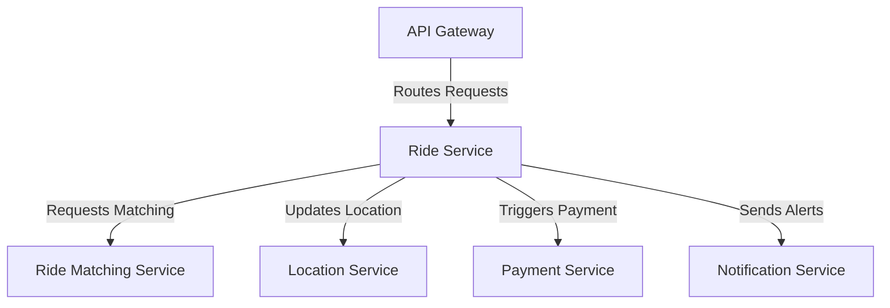

# Ride Service

The Ride Service is a core microservice in the ride-booking system, responsible for managing ride requests, fare estimation, and ride lifecycle states (e.g., requested, accepted, completed).

## Key Features
- **Ride Request Handling**: Processes booking requests from passengers.
- **Fare Estimation**: Calculates estimated costs based on distance, time, and vehicle type.
- **Ride Lifecycle Management**: Tracks ride status from initiation to completion.

## Architecture Diagram

## Interaction with Other Services
The Ride Service collaborates with other microservices to manage the core ride functionality:
- **API Gateway**: Receives ride-related requests from client apps (Passenger and Driver Apps) and routes them to Ride Service.
- **Ride Matching Service**: Works with Ride Service to match passengers with drivers based on ride requests.
- **Location Service**: Provides location data to assist in fare estimation and ride tracking.
- **Payment Service**: Initiates payment processing once a ride is completed, based on fare data from Ride Service.
- **Notification Service**: Sends status updates (e.g., ride accepted, completed) triggered by Ride Service events.

