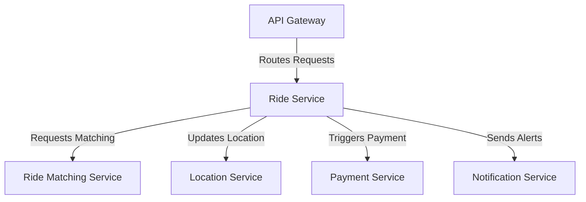

# Ride Service

The Ride Service is a core microservice managing ride requests, fare estimation, and ride lifecycle states in the ride-booking system.

## Key Features
- Ride Request Handling
- Fare Estimation
- Ride Lifecycle Management

## Recommended Tech Stack
- **Runtime**: Go for high performance and scalability in handling ride logic [1][5].
- **Framework**: DropWizard or custom Go frameworks for business logic [4].
- **Database**: PostgreSQL for relational ride data storage [1][4].
- **Mapping API**: Google Maps API for distance and ETA calculations [2][4].

## System Design Structure
- **Request Handler**: Processes incoming ride requests via API Gateway.
- **Fare Calculator**: Uses mapping APIs and pricing models for estimates.
- **State Manager**: Tracks ride states (requested, accepted, completed).
- **Database Layer**: Stores ride details and links to fare entities.
- **Event Trigger**: Initiates matching and notifications post-request.

## Architecture Diagram

## Interaction with Other Services
The Ride Service coordinates core ride operations:
- **API Gateway**: Receives client ride requests.
- **Ride Matching Service**: Triggers driver matching.
- **Location Service**: Fetches location data for fare and ETA.
- **Payment Service**: Initiates payment on ride completion.
- **Notification Service**: Sends ride status updates.

